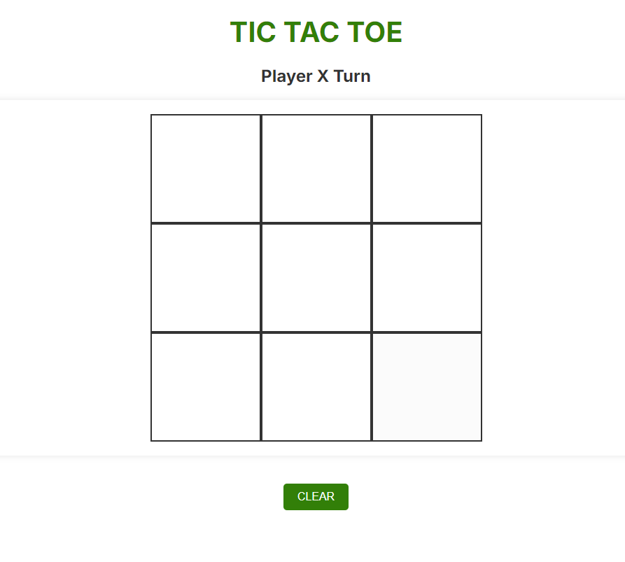
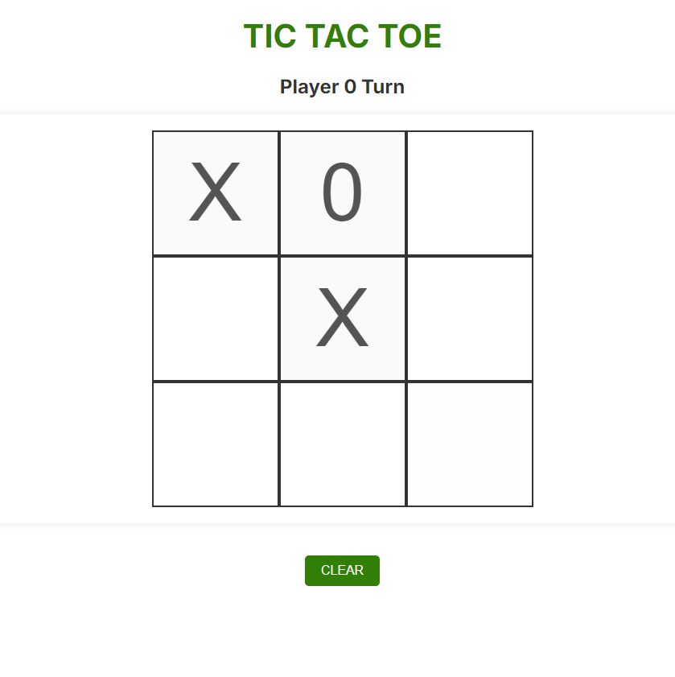
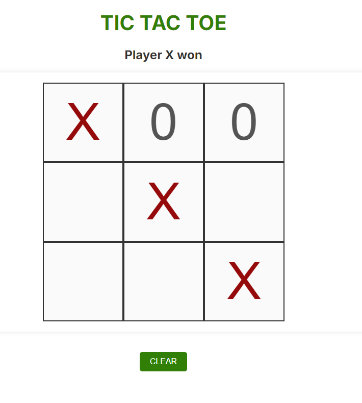
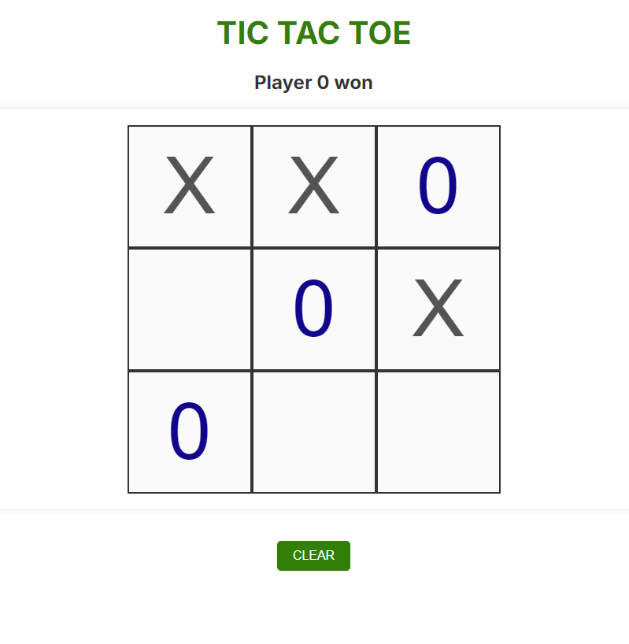

# TicTacToe

# My Design System
This repository documents the design system for Tic-Tac-Toe game for deliverable 2.
[Tic-Tac-Toe](docs/design_system.md)

# Description

This is a simple Tic Tac Toe game implemented using HTML, CSS, and JavaScript.

## How to Play

- The game is played on a 3x3 grid.
- Player X will start the game.
- Players take turns clicking on the empty cells.
- The first player to get three of their marks in a row (horizontally, vertically, or diagonally) wins.
- If all the cells are filled and neither player has three in a row, the game is a draw.

## Features

- Smooth transition effects for cell interactions.
- Visual indication of the player's turn.
- Clear button to reset the game board.
- Animated highlighting of the winning cells.

## Screenshots

### Start of the Game

### During the Game

### Game Over - Player X Won

### Game Over - Player 0 Won

## How to Run

1. Play on GitHub.
    https://alperenakin.github.io/TicTacToe/

2. Or clone the repository.
   git clone https://github.com/AlperenAkin/TicTacToe.git
